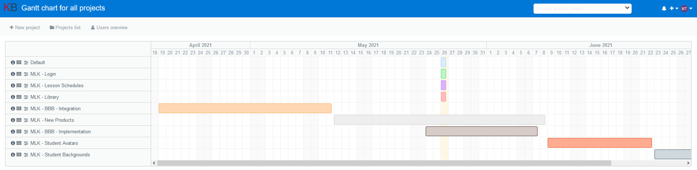
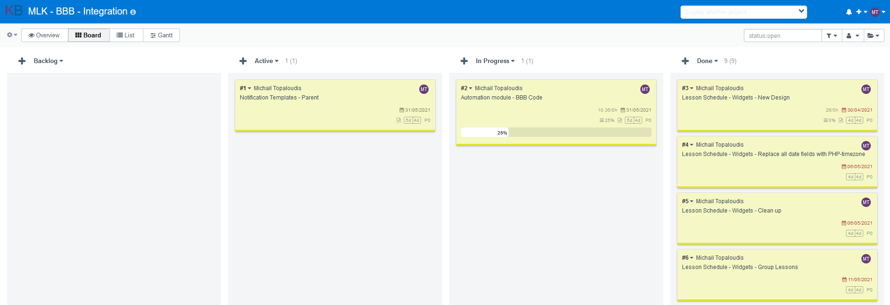
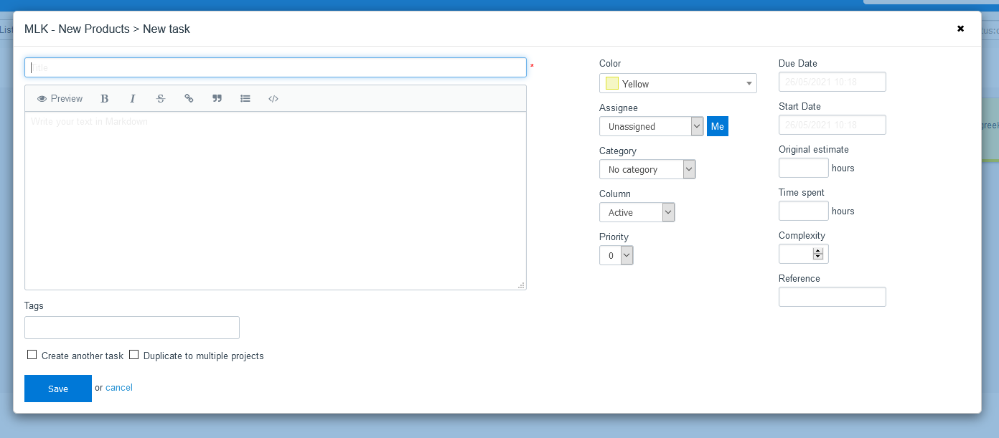
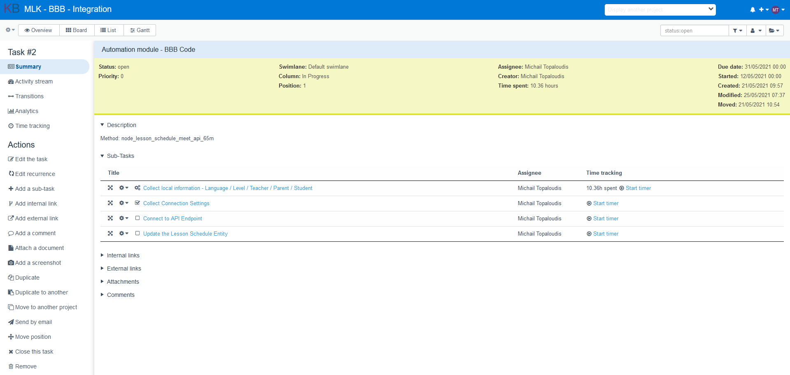

# OneExperienceKB
"One Experience" is a theme based on FreeScout's UI.

Screenshots
------------







Author
------------
- Michail Topaloudis
- License MIT


Requirements
------------
Kanboard >= v1.0.48  
Kanboard installed at a web server.
You can find the download at [kanboard.org](https://kanboard.org/)

Installation
------------
You have the choice between 2 methods:

1. Download the zip file and decompress everything under the directory `plugins/OneExperienceKB`
2. Clone this repository into the folder `plugins/OneExperienceKB`

Note: Plugin folder is case-sensitive.  
**Important: remove all unused themes**

Known Issues
------------
1. Improve the jQuery Date Selector
2. Responsive support

Add options for the theme
------------
- Replace the KB logo with your own logo  
For more information have a look in the config.php  
### Supports the [Customizer](https://github.com/creecros/Customizer) plugin

Syntax highlighting for Markdown code
------------
151 languages currently supported by Prism, with their corresponding alias, to use in place of xxxx
 
```diff
-```xxxx
class BaseClass {
    function __construct() {
        print "In BaseClass constructor\n";
    }
}
-```
+```php
class BaseClass {
    function __construct() {
        print "In BaseClass constructor\n";
    }
}
+```
```

KanBoard Plugin Support
------------
This theme has support for the following plugins:
1. [Gantt](https://github.com/kanboard/plugin-gantt) by Frédéric Guillot
2. [Bigboard](https://github.com/BlueTeck/kanboard_plugin_bigboard) by BlueTeck, Thomas Stinner, Pierre Cadeot, PapeCoding
3. [StarredProjects](https://github.com/biblibre/kanboard-plugin-StarredProjects) by BibLibre
4. [TaskProgressBar](https://github.com/kenlog/TaskProgressBar) by Valentino Pesce
5. [Customizer](https://github.com/creecros/Customizer) by  Craig Crosby

Reporting Issues
------------
Please [create an issue](https://github.com/mojiro/OneExperienceKB/issues) for any bugs you've found.
